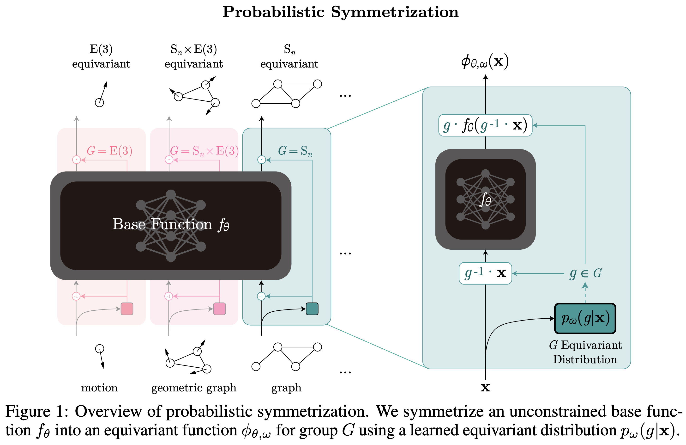

# Probabilistic Symmetrization (PyTorch)

**Learning Probabilistic Symmetrization for Architecture Agnostic Equivariance** \
[Jinwoo Kim](https://bit.ly/jinwoo-kim), [Tien Dat Nguyen](https://github.com/tiendatnguyen-vision), [Ayhan Suleymanzade](https://github.com/MisakiTaro0414), [Hyeokjun An](https://hyeokjun-an.github.io/hyeokjun-an/Hyeokjun-An.html), [Seunghoon Hong](https://maga33.github.io/) @ [KAIST](https://www.kaist.ac.kr/en/) \
NeurIPS 2023 Spotlight Presentation

[](https://arxiv.org/abs/2306.02866)



## Setup

Using Docker image (recommended)

```bash
docker pull jw9730/lps:latest
docker run -it --gpus all --ipc host --name lps -v /home:/home jw9730/lps:latest bash
# upon completion, you should be at /lps inside the container
```

Using ```Dockerfile```

```bash
git clone https://github.com/jw9730/lps.git /lps
cd lps
docker build --no-cache --tag lps:latest .
docker run -it --gpus all --ipc host --name lps -v /home:/home lps:latest bash
# upon completion, you should be at /lps inside the container
```

Using ```pip```

```bash
sudo apt update
sudo apt install python3.8
git clone https://github.com/jw9730/lps.git lps
cd lps
bash install.sh
```

## Running Experiments

Graph isomorphism learning on GRAPH8c, EXP, and EXP-classify (Section 3.1 and Appendix 4.1)

```bash
cd scripts

# GRAPH8c
bash graph8c_mlp_canonical.sh
bash graph8c_mlp_ps.sh
bash graph8c_gin_id_canonical.sh
bash graph8c_gin_id_ps.sh

# EXP
bash exp_mlp_canonical.sh
bash exp_mlp_ps.sh
bash exp_gin_id_canonical.sh
bash exp_gin_id_ps.sh

# EXP-classify
bash exp_classify_mlp_canonical.sh
bash exp_classify_mlp_ps_fixed_noise.sh
bash exp_classify_mlp_ps.sh
bash exp_classify_gin_id_canonical.sh
bash exp_classify_gin_id_ps.sh
```

Particle dynamics learning on n-body (Section 3.2 and Appendix 4.2)

```bash
cd scripts

# n-body
bash nbody_transformer_canonical.sh
bash nbody_transformer_ga.sh
bash nbody_transformer_ps.sh
bash nbody_gnn_canonical.sh
bash nbody_gnn_ga.sh
bash nbody_gnn_ps.sh
```

Graph pattern recognition on PATTERN (Section 3.3)

```bash
cd scripts

# PATTERN
bash pattern_vit_scratch_ga.sh
bash pattern_vit_scratch_fa.sh
bash pattern_vit_scratch_canonical.sh
bash pattern_vit_scratch_ps.sh
bash pattern_vit_imagenet21k_ga.sh
bash pattern_vit_imagenet21k_fa.sh
bash pattern_vit_imagenet21k_canonical.sh
bash pattern_vit_imagenet21k_ps.sh
```

Real-world graph learning on Peptides-func, Peptides-struct, and PCQM-Contact (Section 3.4)

```bash
cd scripts

# Peptides-func
bash peptides_func_vit_imagenet21k_ps.sh

# Peptides-struct
bash peptides_struct_vit_imagenet21k_ps.sh

# PCQM-Contact
bash pcqm_contact_vit_imagenet21k_ps.sh
```

Supplementary analysis on EXP-classify and inner-symmetric graphs (Appendix 4.3 and 4.4)

```bash
cd scripts

# effect of sample size on training and inference
# + additional comparison to group averaging
bash exp_classify_mlp_ps_analysis.sh

# additional comparison to canonicalization
bash automorphism_mlp.sh
```

## Trained Models

Trained model checkpoints can be found at [this link](https://drive.google.com/drive/folders/12P95QRLERYSqh-v8vIGB-yCKNGDzj727?usp=sharing).
To run analysis or testing, please find and download the checkpoints of interest according to the below table.
After that, you can run each experiment script (*e.g.*, `bash nbody_transformer_ps.sh`) to skip training and run testing.

| Experiment | Download Path |
|---|---|
| n-body | `src_synthetic/nbody/experiments/checkpoints/[EXP_NAME]/*.ckpt` |
| PATTERN | `experiments/checkpoints/gnn_benchmark_pattern/[EXP_NAME]/*.ckpt` |
| Peptides-func | `experiments/checkpoints/lrgb_peptides_func/[EXP_NAME]/*.ckpt` |
| Peptides-struct | `experiments/checkpoints/lrgb_peptides_struct/[EXP_NAME]/*.ckpt` |
| PCQM-Contact | `experiments/checkpoints/lrgb_pcqm_contact/[EXP_NAME]/*.ckpt` |
| Supplementary analysis | `src_synthetic/graph_separation/experiments/checkpoints/[EXP_NAME]/*.ckpt` |

## References

Our implementation uses code from the following repositories:

- [Frame Averaging](https://github.com/omri1348/Frame-Averaging) for GRAPH8c, EXP, EXP-classify, and n-body experiments
- [Vector Neurons](https://github.com/FlyingGiraffe/vnn) for n-body experiments
- [Benchmarking Graph Neural Networks](https://github.com/graphdeeplearning/benchmarking-gnns) for PATTERN experiments
- [Long Range Graph Benchmark](https://github.com/vijaydwivedi75/lrgb) for Peptides-func, Peptides-struct, and PCQM-Contact experiments

## Citation

If you find our work useful, please consider citing it:

```bib
@article{kim2023learning,
  author    = {Jinwoo Kim and Tien Dat Nguyen and Ayhan Suleymanzade and Hyeokjun An and Seunghoon Hong},
  title     = {Learning Probabilistic Symmetrization for Architecture Agnostic Equivariance},
  journal   = {arXiv},
  volume    = {abs/2306.02866},
  year      = {2023},
  url       = {https://arxiv.org/abs/2306.02866}
}
```
